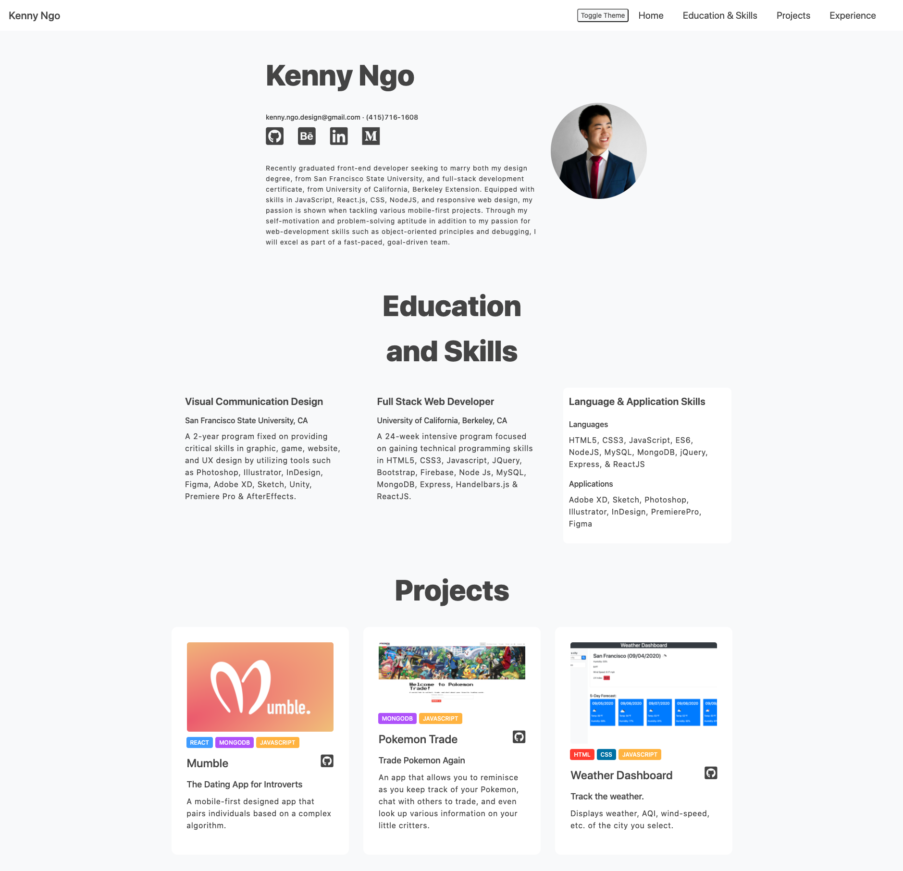
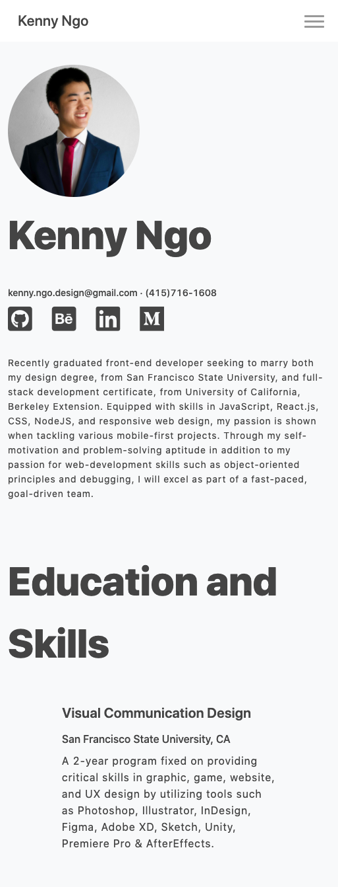
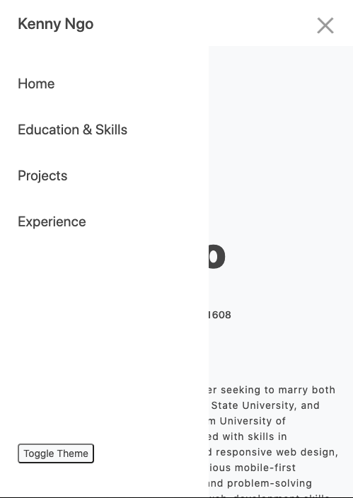
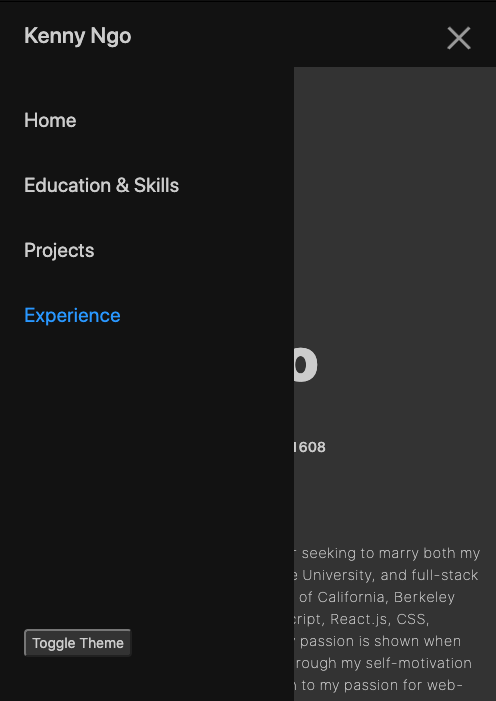
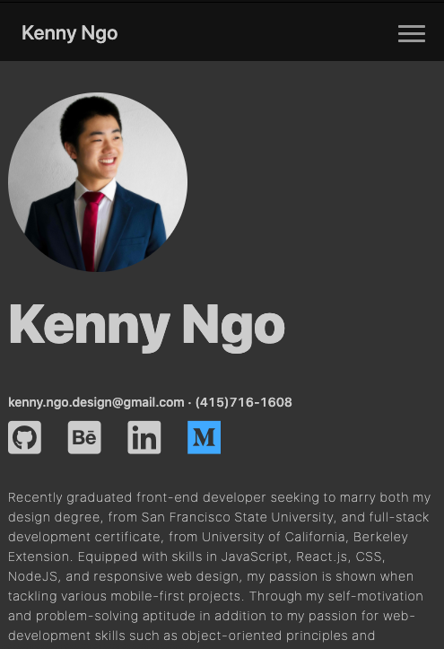

# My Portfolio Site!

## Description

My portfolio site created using mainly ReactJS and SASS. Of course, there are inclusions of hooks, states, and even dark mode. This site was **designed and coded by Kenny Ngo** and I'm rather proud of this, but I will always further continue to update/upgrade my portfolio!

## Installation

Use the package manager [npm](https://npmjs.com) to install dependencies

```
npm install
```

[Github Link](https://github.com/kennykngo/react-portfolio)

[Deployment Link](https://kennyngo.herokuapp.com/)

## Visuals

The images below consists of both mobile and desktop view as well as dark mode and light mode!






## Roadmap

In the future, I would like to:

- modernize by updating the dark mode toggle
- Change the styling to make the dark mode more easier to read for both mobile and desktop view
- Make the site more responsive than it already is!
- Design and add a logo onto the site.
